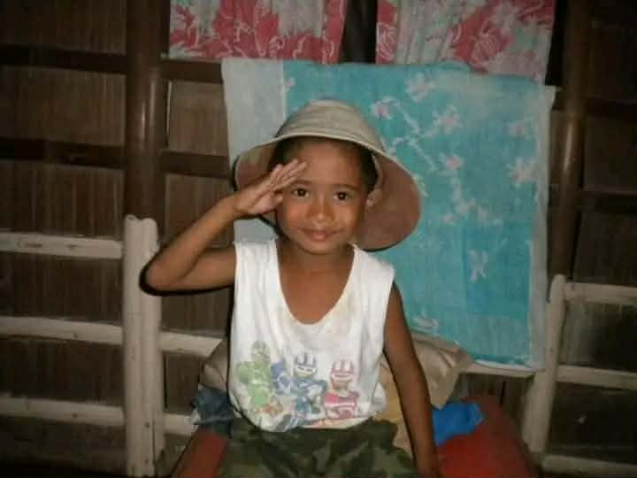
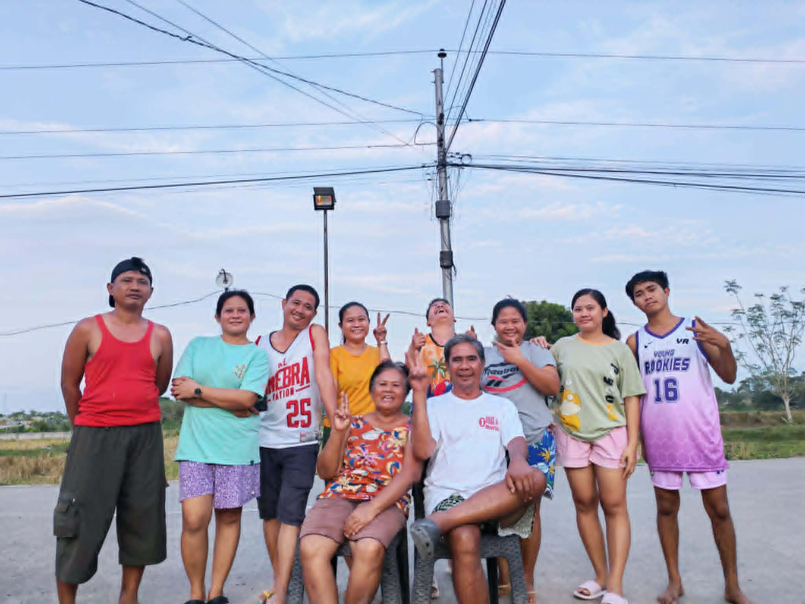
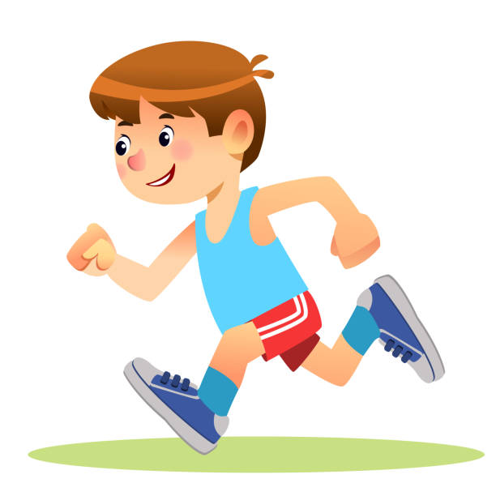

        <!DOCTYPE html>
        <html lang="en">
        <head>
            <meta charset="UTF-8">
            <meta name="viewport" content="width=device-width, initial-scale=1.0">
            <title>Jordan Tianio | Portfolio</title>
            <link href="https://fonts.googleapis.com/css2?family=Poppins:wght@300;400;600&display=swap" rel="stylesheet">
            
        </head>
        <body>

            <nav>
                
JT Portfolio

            
                <ul>
                    <li><a href="#home">Home</a></li>
                    <li class="dropdown">
                        <a href="#">Gallery ▾</a>
                        

                            <a href="#gallery">My Image</a>
                            <a href="#family">My Family</a>
                        

                    </li>
                    <li><a href="#dreams">Dreams</a></li>
                    <li><a href="#interest">Interest</a></li>
                    <li><a href="#about">About Me</a></li>
                    <li class="search-container">
                        <input type="text" id="searchInput" placeholder="Search...">
                        <button id="searchBtn">🔍</button>
                    </li>
                    </ul>
            </nav>

            <section id="home" class="section">
                <h1>Welcome To My Portfolio</h1>
                

                    
                    

                        
In the world of technology, we are taught that every complex system is built one line of code at a time. My life is much the same—a work in progress where my family is the foundation, my education is the framework, and my dreams are the vision. I believe that learning is not just about gathering facts, but about refining the soul; it is the process of turning our curiosity into a compass that helps us navigate the unknown. Every challenge I face is a lesson that upgrades my character, and every success is a tribute to those who supported me from the start. I code not just to build programs, but to build a future where my work leaves the world a little more functional, a little more connected, and a lot more meaningful than I found it

                    

                

            </section>

            <section id="gallery" class="section">
                <h1>Gallery</h1>
                

                    

                        

                            
                        

                        
"Grown enough to know the simple things are the best things."

                        My Image
                    

                    

                        

                            
                        

                        
"Living the moment."

                        My Image
                    

            
                    

                        

                            
                        

                        
"The simplest days with them are always the loudest in my heart"

                        My Family
                    

                

            </section>

            <section id="dreams" class="section dark-section">
                <h1>Dreams</h1>
                

                    
                    

                        
My dream is to walk across that stage, feeling the weight of a diploma that represents every late night and every line of code. I imagine a future where I am not just using technology, but mastering it as an IT professional who builds and protects. There will be days when the systems crash and the solutions seem impossible to find. In those moments of frustration, I will hold onto the truth that every failed script is just a blueprint for a better one.

                        
 I want to earn a place in the tech world that allows me to provide for my family and build a life of stability. The complexity of the digital world doesn't scare me; it invites me to keep learning, growing, and adapting. I see every challenge in my studies as a necessary step toward the expert I am destined to become. With a steady heart and a focused mind, I will turn this vision into my reality.

                    

                

            </section>

            <section id="interest" class="section dark-section" style="background-color: #1e5a7a;">
                <h1>Interest</h1>
                

                    

                        
                        <h3>ONLINE GAMES</h3>
                    

                    

                        
                        <h3>Basketball</h3>
                    

                    

                        
                        <h3>Jogging</h3>
                    

                

                
Hobbies make my free time enjoyable and help me think creatively.

            </section>

            <section id="about" class="section">
                <h1>About Me</h1>
                

                    
Hello! My name is <strong>Jordan Tianio</strong>, and I am a 2nd-year college student taking Bachelor of Science in Computer Science (BSCS).

                    
I come from a big family with 8 siblings—5 girls and 3 boys—which has helped me become responsible, patient, and adaptable in different situations.

                    
One of my favorite hobbies is playing basketball, as it keeps me active and teaches me teamwork and discipline. I completed my Grade 10 moving-up in 2022 at QNHS and graduated from ICF in Senior High School in 2024.

                    
When I was a child, I dreamed of becoming a police officer, but as I grew older, I discovered my interest in technology, which led me to pursue BSCS. I am the kind of person who loves learning new things in life, always curious and eager to grow.

                    
My parents have always guided me with important values. They taught me to be content with what I have and to always be thankful to God for all the blessings in life. These lessons continue to inspire me to stay humble, work hard, and appreciate every opportunity that comes my way.

                

            </section>

            <footer>
                &copy; 2026 Jordan Tianio Portfolio
            </footer>

            
        </body>
        </html>
